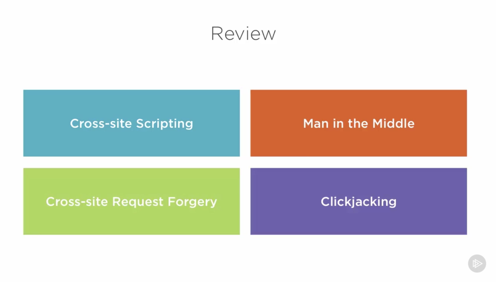
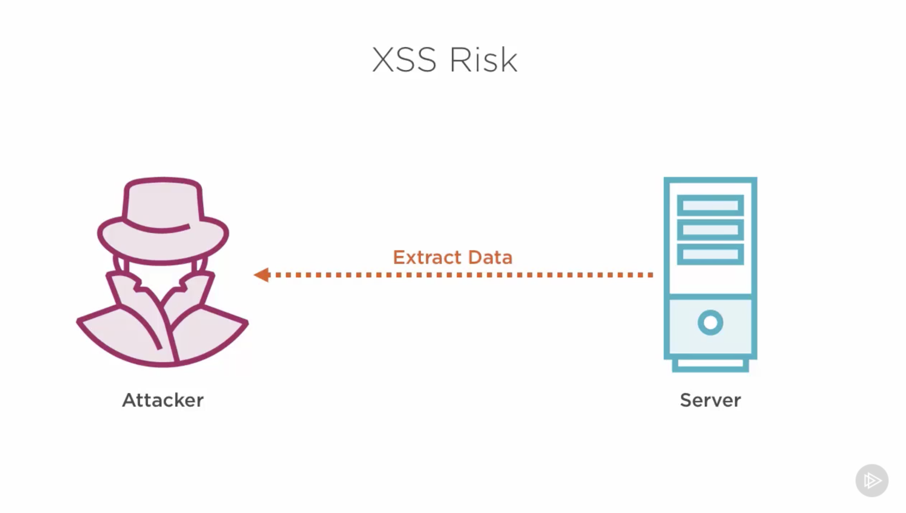
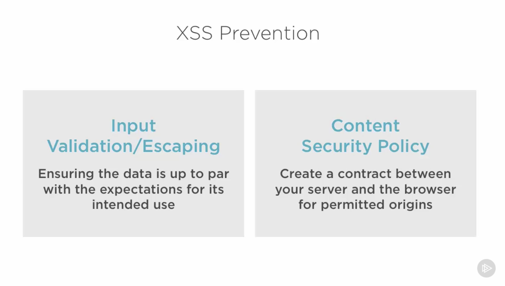
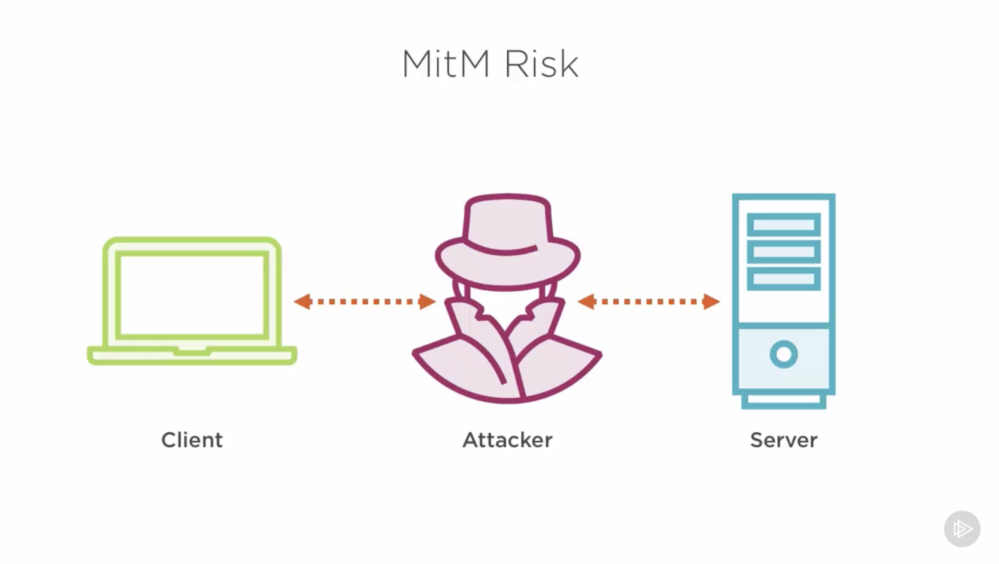
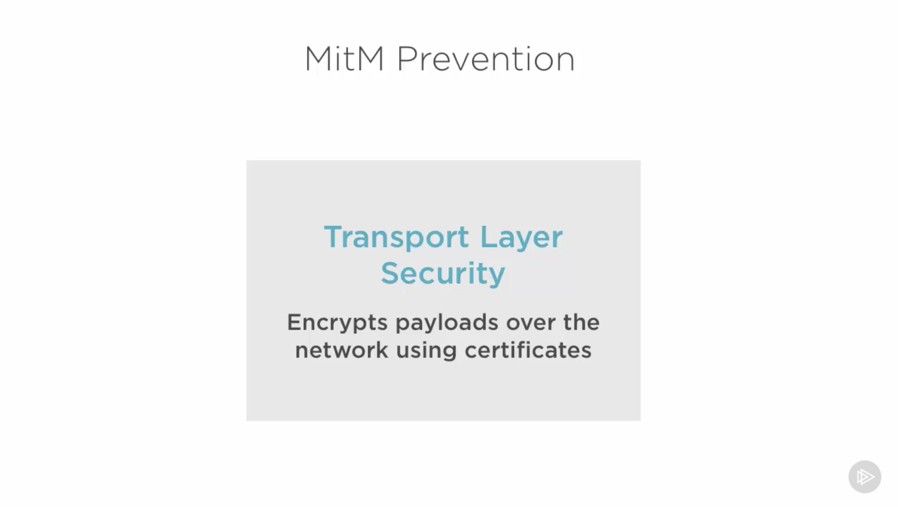
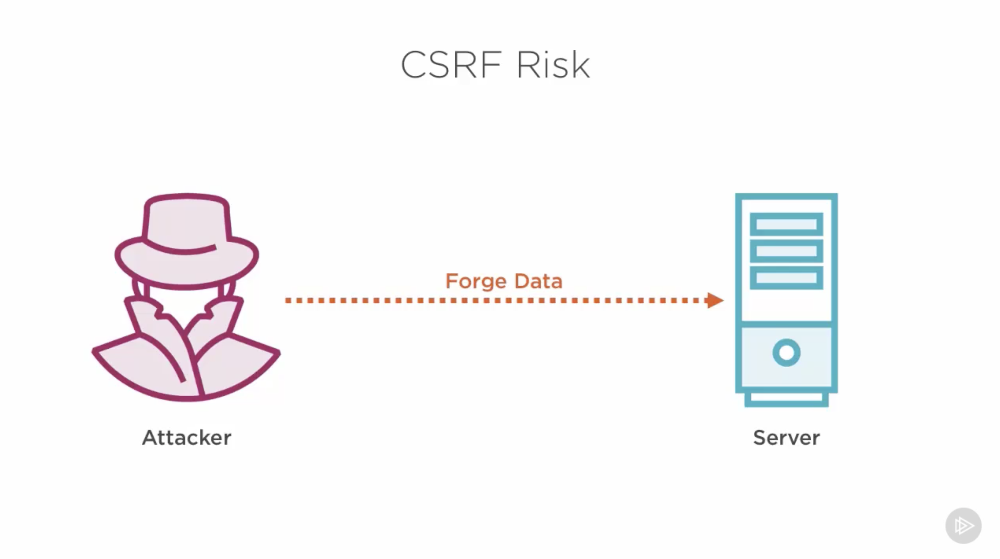
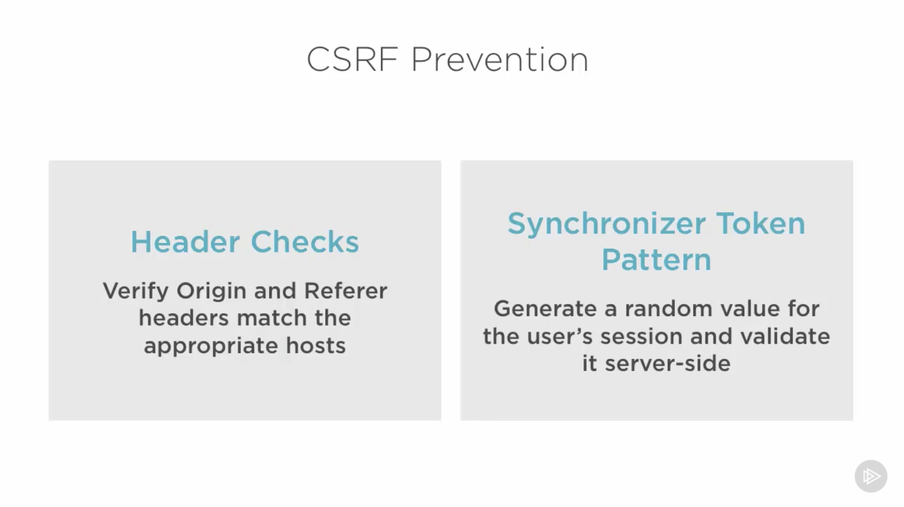
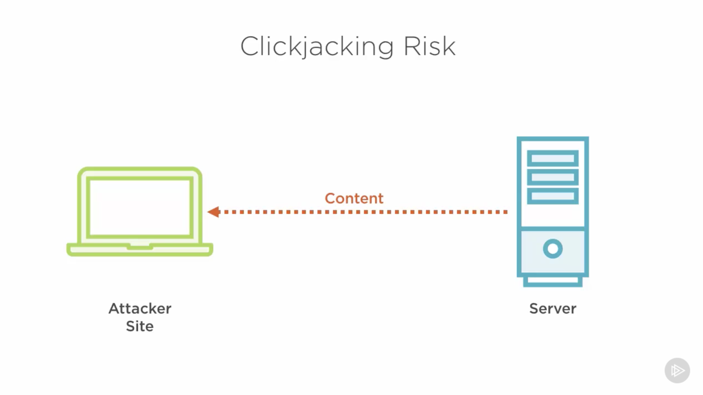
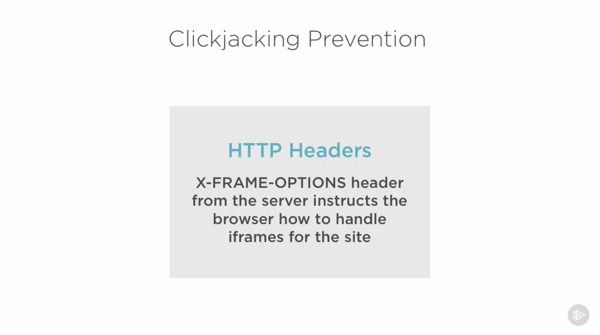
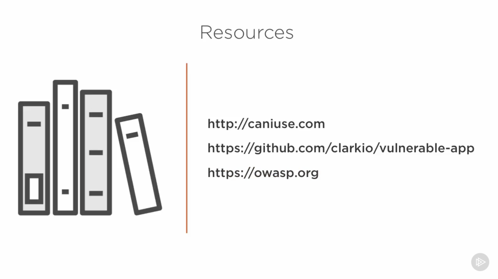

# App Security Notes

## Protecting Data from Extraction

### Input handling
- Input validation: Ensure the legitimacy of input types, e.g., integer, email address, etc.
- Sanitization: Clean malicious input, e.g., script tags.
- Escaping: Transform output to escape '<', '>', and so forth.
  - The npm package `xss-filters` can perform escaping services on front/back end.

### Content Security Policy (CSP)
- Mitigates Cross Site Scripting (XSS) and data injection attacks.
- Specifies from where, or how, external resources can be loaded (scripts, images, styles, media, etc).
- Not a replacement for proper input handling.
- Helps identify vulnerable areas.
- Uses an HTTP header.
  - `Content-Security-Policy: default-src 'self'; style-src: 'self'; img-src: 'self' http://example.com;`
  - `default-src`: default policy for resources not otherwise specified.
  - `'self'`: specifies that the originating host is permitted for resources.
  - `http://example.com`: additional domain from which a resource can be loaded.
  - **Not supported by some older browsers** and should be considered a fallback for proper input handling. (On IE 11, supported through the X-Content-Security-Policy header.)
- Limits resource origins.
- Blocks inline styles and scripts.
  - \<p style="margin-left: 10px;">...</p>
- The npm package `lusca` provides CSP functionality and other security features.

## Hide Network Traffic from Snooping

### Man in the Middle Attack
- An attacker is able to intercept data on the network between the client and server.
- Sensitive data, such as cookies in request and response headers, may be visible.
- Headers may also be modified, such as response headers from the server, before reaching the client.

### Transport Layer Security
- Encrypts payloads over the network using certificates.
- Sometimes referred to as SSL (Secure Sockets Layer).
- Uses HTTPS protocol.
- Helps ensure data privacy and security.
- Encrypts the connection across the network.

### Generating a Self-Signed Certificate
- Should only be used for development.
- Command: `openssl req -x509 -newkey rsa:2048 -keyout vulnapp-key.pem -out vulnapp-cert.pem -days 365`
- Clear the password on the key: `openssl rsa -in vulnapp-key.pem -out newkey.pem && mv newkey.pem vulnapp-key.pem`

```javascript
var https = require('https')
var fs = require('fs')

var options = {
    key: fs.readFileSync('vulnapp-key.pem'),
    cert: fs.readFileSync('vulnapp-cert.pem'),
    // passphrase: 'asdf' // not needed when we clear the key password
}

https.createServer(options, app).listen(port, function () {
    console.log('Express server listening on port ' + port);
    console.log('env = ' + app.get('env') +
        '\n__dirname = ' + __dirname  +
        '\nprocess.cwd = ' + process.cwd());
})
```

## Ensure Legitimacy of Requests

### Cross-Site Request Forgery

CSRF: An attack that submits unauthorized requests on behalf of a user that is unkown to the user and trusted by the website receiving the requests.

#### Prevention
- Header checks: verify origin and referrer headers match the appropriate hosts.
  - Origin and Referrer headers: these identify where requests came from, and can indicate if the request is legitimate.
    - Requests provide either one or both of these headers.
    - These headers are impossible to spoof via CSRF, unless XSS (Cross-Site Scripting) vulnerabilities exist.
      ```
      Content-Type: application/x-www-form-urlencoded; charset=UTF-8
      Origin: https://www.example.com
      Referer: https://www.example.com
      ```
    - If the `Origin` header is present, check that it matches the site's origin (or trusted sites). If this header exists, we don't need to check anything else.
    - Otherwise, check the `Referer` header in the same manner as we would check the `Origin` header.
    - **We must assure that the checks are resiliant to 'workarounds'**, e.g., example.com.attacker.com.
    - If neither header is present, we can either allow the request or deny it. The recommendation is to block the request, to err on the side of caution.
- Synchronizer Token Pattern: Generate a random value for the user's session and validate it server side.
  - The token should be a crypto-secure random string of sufficient entropy as to be unguessable.
  - The token must be specific to each user and their session so that there is no potential for reuse.
  - The token should be required for any state-changing operation on the server, such as updating user profile data or any other such write operation.
  - The token should be validated server side so that we have total control of whether the operation is executed or not.
  - Example:
    - User login request received by server.
    - Session created by server.
    - Response delivered to client.
    - User requests profile page from server.
    - Profile page delivered to client along with a token.
    - Update profile request made to the server, with previously given token.
    - Server validates token.
      - If valid, execute requested update operation.
      - Otherwise, don't execute update operation.
  - "In general, developers need only generate this token once for the current session. After initial generation of this token, the value is stored in the session and is utilized for each subsequent request until the session expires. When a request is issued by the end-user, the server-side component must verify the existence and validity of the token in the request as compared to the token found in the session. If the token was not found within the request or the value provided does not match the value within the session, then the request should be aborted, token should be reset and the event logged as a potential CSRF attack in progress."
  https://www.owasp.org/index.php/Cross-Site_Request_Forgery_%28CSRF%29_Prevention_Cheat_Sheet
  - "To take advantage of this, your server needs to set a token in a JavaScript readable session cookie called XSRF-TOKEN on either the page load or the first GET request. On subsequent requests the server can verify that the cookie matches the X-XSRF-TOKEN HTTP header, and therefore be sure that only code running on your domain could have sent the request. The token must be unique for each user and must be verifiable by the server; this prevents the client from making up its own tokens. Set the token to a digest of your site's authentication cookie with a salt for added security."
  https://angular.io/guide/http#security-xsrf-protection
- Additionally, there should be no Cross-Site Scripting vulnerabilities in the application because they can be used to undermine CSRF protections.
- The npm package `lusca` provides CSRF/XSRF functionality and other security features.

## Block Content Hijacking

### Clickjacking (UI Redress Attack)

An attack where users are tricked into clicking on something that performs an action the user was not intending to execute. (Uses an IFrame.)

#### Prevention With Headers
- Header: `X-FRAME-OPTIONS`
  - Values:
    - `DENY`: The browser will deny any attempts to load host content into an IFrame.
    - `SAMEORIGIN`: The browser will allow the content to be loaded when operating within the same origin as the site itself.
    - `ALLOW-FROM`: Lets us define a list of origins that are permitted to load our site's content. Multiple origins are separated by spaces. **Not all modern browsers support this value, as they are moving to using Content Security Policy configurations.
      - "Partial support refers to not supporting the ALLOW-FROM option. The X-Frame-Options header has been obsoleted by the frame-ancestors directive from Content Security Policy Level 2." https://caniuse.com/#search=x-frame-options
      - See also: https://caniuse.com/#search=content%20security%20policy
- The npm package `lusca` provides X-FRAME-OPTIONS header-setting functionality and other security features.

#### Content Security Policy
- `frame-ancestors`
  - Values:
    - `'none'`: Behaves the same way as `X-FRAME-OPTIONS:DENY`.
    - `'self'`: Behaves the same way as `X-FRAME-OPTIONS:SAMEORIGIN`.
    - [URLs]: Indicates which origins will be allowed to load our content.
- The npm package `lusca` provides CSP functionality and other security features.

## Summary



### Cross-Site Scripting





### Man in the Middle





### Cross-Site Request Forgery





### Clickjacking





Content Security Policy, `frame-ancestors` directive (no screenshot)

### Resources


